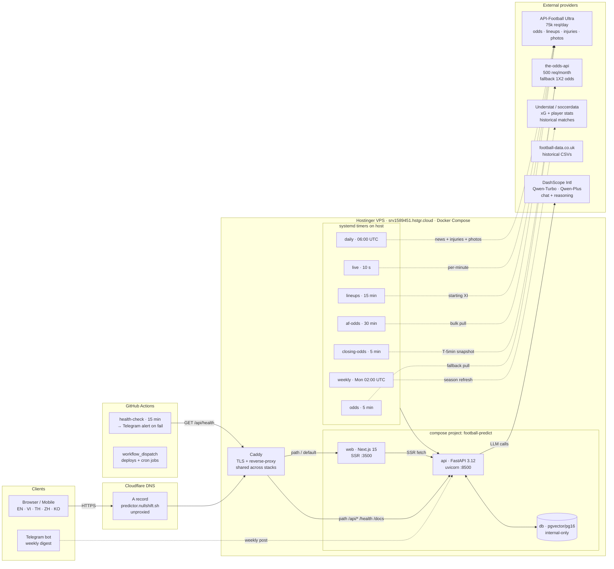

# Infra overview — predictor.nullshift.sh

> Một-trang tóm tắt topology + data-flow, dành cho vendor / đối tác kỹ thuật (Alibaba, API providers, v.v).
> Live URL: **https://predictor.nullshift.sh**

---

## 1. High-level topology



---

## 2. Stack summary

| Layer | Tech | Where | Notes |
|---|---|---|---|
| Frontend | Next.js 15 (App Router) + Tailwind | `web` container, port 3500 | SSR-first, 5 locales, Payy design |
| Backend | Python 3.12 + FastAPI + asyncpg | `api` container, port 8500 | 20 routers, 33 ingest scripts |
| Database | Postgres 16 + **pgvector** | `db` container, internal-only | 15 tables, nightly `pg_dump` off-box |
| LLM | Qwen via **LiteLLM** | DashScope Intl endpoint | `qwen-turbo` bulk · `qwen-plus` for big matches · Haiku fallback |
| Reverse proxy | Caddy | host-level, shared | TLS via Let's Encrypt, path routing |
| DNS | Cloudflare | unproxied A record | consistent with sibling Shinhan stacks |
| CI/CD | GitHub Actions + bare-repo push | `git push vps main` → `post-receive` hook rebuilds | no manual rsync |
| Monitoring | health-check GH Action + Telegram | 15-min external probe → bot alert on failure | also ops-alert systemd locally |

---

## 3. Data providers

| Provider | Usage | Quota | Priority |
|---|---|---|---|
| **API-Football Ultra** | pre-match odds (1X2 / O/U / AH / BTTS), live scores, lineups, injuries, player photos | **75,000 req/day** | **Primary** for odds |
| the-odds-api | 1X2 closing line snapshot (CLV) | 500 req/month free | Fallback only — BTTS gated |
| Understat (via soccerdata) | xG, player season stats, historical schedules | free, rate-limited | Primary for xG |
| football-data.co.uk | historical bookmaker odds CSVs | free | Historical only |
| DashScope (Qwen) | chat + reasoning prose | paid, ~150k tokens/day used | LLM layer |

---

## 4. Key data tables

```
teams                    — slug, name, elo_rating, league_code, api_football_id
matches                  — fixtures + xG + live state; 7 seasons × 5 top leagues
predictions              — model output (ensemble v3: Poisson + Elo 0.20 + XGB 0.60), SHA-256 commitment_hash
match_odds               — 1X2 per source (the-odds-api, af:*, football-data)
match_odds_markets       — O/U, AH, BTTS per source (Phase 6b)
closing_odds             — T-5min snapshot for CLV
player_season_stats      — xG/xA/goals/assists + photo_url proxy
player_injuries          — injury list → λ shrink
match_lineups            — starting XI from API-Football
match_events             — goal/card/sub stream (live)
match_weather            — wind/rain adjustments (λ multiplier)
chat_messages            — multi-turn Q&A + pgvector RAG
news_items               — RSS-aggregated team-scoped headlines
tipsters / tipster_picks — community log-loss leaderboard
```

---

## 5. Daily traffic pattern (typical match-day)

```
T-24h → af-odds every 30 min pulls 1X2 + O/U + BTTS + AH; predict_upcoming runs on new fixtures
T-3h  → lineups timer kicks in, starting XI slowly resolves via API-Football
T-1h  → lineup-sum λ multiplier refines predictions (Phase 13)
T-5min → closing_odds snapshot (CLV reference, Phase 5)
T-0   → live timer every 10s captures goals/cards/possession + updates score
T+0h  → post_telegram_recap (optional per fixture)
Mon   → weekly.timer: recap digest → Telegram, season backtest, predict_upcoming horizon refresh
```

---

## 6. Scaling posture

- **One VPS, no horizontal scaling** — entire stack (+sibling stacks: Shinhan ai-hub, bi, fin, docflow, tasco-drive, nullvote) on shared host
- **Postgres internal-only** — no external port, no auth Bounce from outside
- **All secrets in `/opt/football-predict/.env`** (mode 600, never committed)
- **Port allocation**: 3500 (web), 8500 (api), 8600 (nullvote), 3600 (tasco), etc. — convention per app
- **Backup**: nightly `pg_dump --clean | gzip` to off-box storage
- **Recovery**: documented runbook at `docs/ops-recovery.md` — < 15 min to full restore from dump

---

## 7. Contact

- Repo: https://github.com/tuantqse90/epl-prediction-lab (private)
- Deploy: `git push vps main` → post-receive hook rebuilds both containers
- Health: https://predictor.nullshift.sh/api/health — returns `{"status":"ok"}` when db reachable
- Ops logs: `docker compose logs api web db` on VPS
